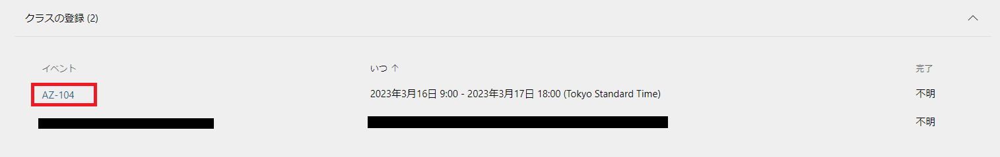
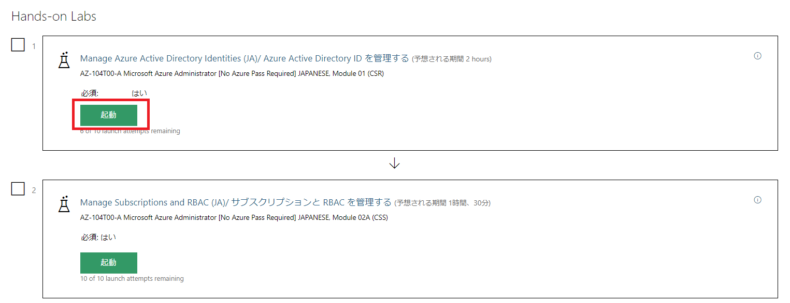
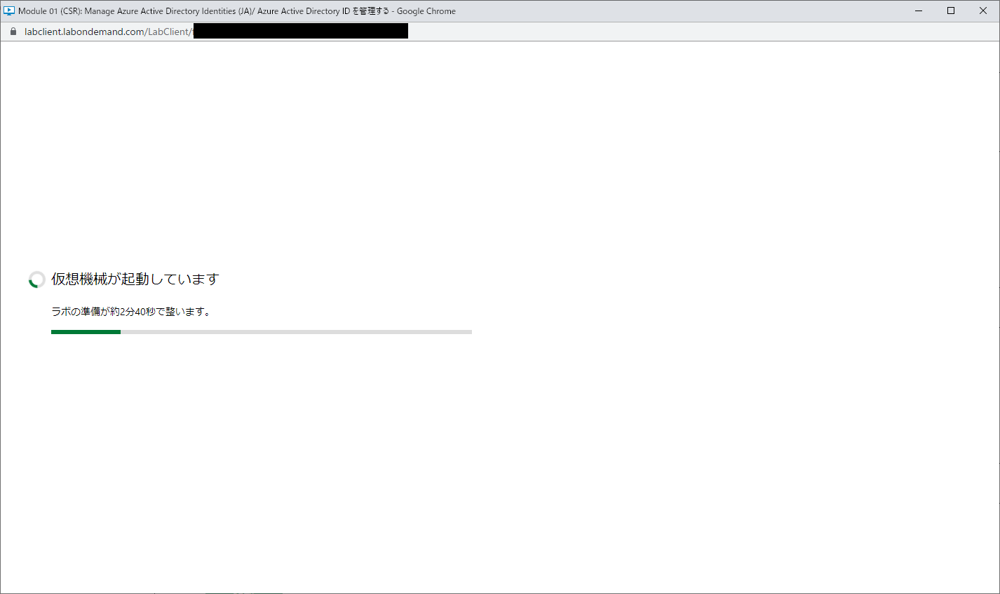
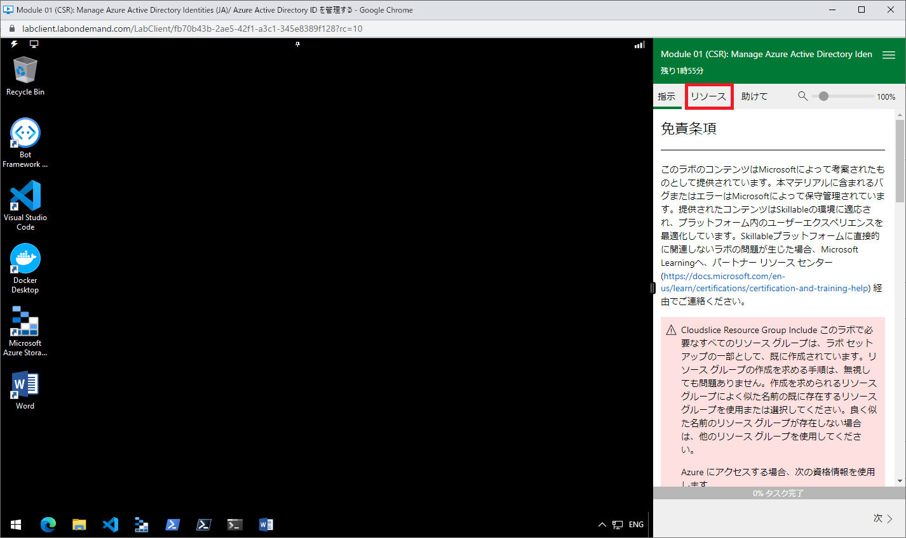
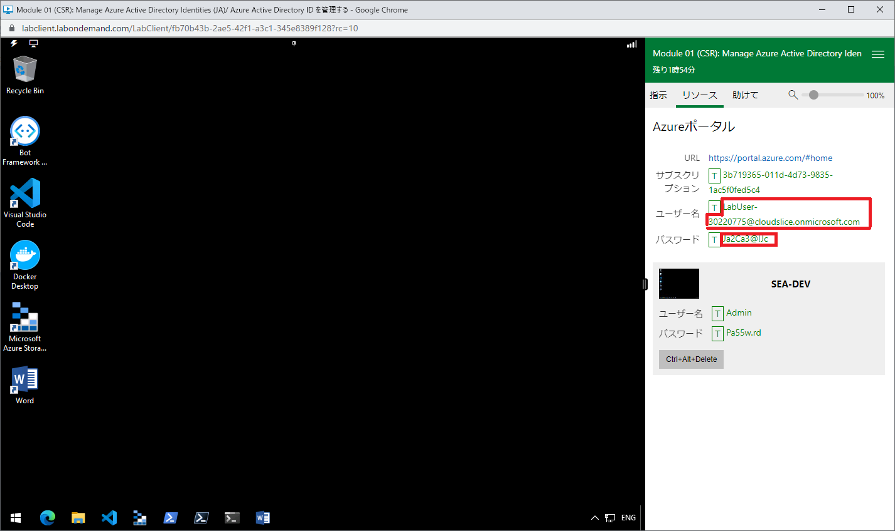
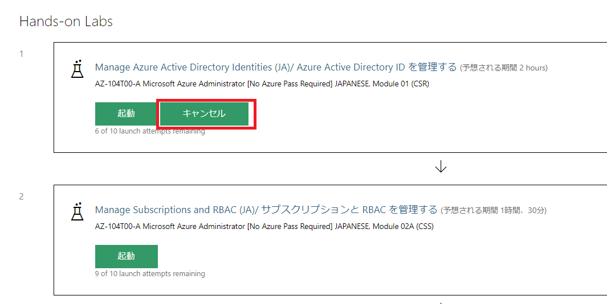

# ラボ環境アクセス用アカウントの取得

# 受講生用ラボ マニュアル

## ラボ シナリオ

本作業は各演習を実施するために必要なハンズオンラボの起動、アカウント情報を取得する作業となります。

各演習実施時に以下の手順を実施してください。

## 目標

このラボでは次の内容を実施します。

+ タスク 1: ハンズオンラボの起動
+ タスク 2: アカウントの確認
+ タスク 3: Azure Portalへのサインイン
+ タスク 4: ハンズオンラボの終了 

## 手順

### 準備 1

#### タスク 1: ハンズオンラボの起動

このタスクでは、Skillableにサインインしてハンズオンラボを起動します。各モジュールの演習毎に実施する作業になります。

1. [Skillable](https://alh.learnondemand.net/) にアクセスし、ご自身の ID とパスワードで サインインします。 

2. サインイン後に表示される**クラスの登録**から、ご受講されているイベントを選択します。

    

    > **注**:上図のイベント名、開催期間については一例です。ご受講いただいているコースで登録したイベントを選択してください。

3. イベントに移動し、**Hands-on Labs**の中から実施したい演習の「**起動**」ボタンをクリックします。

    

4. 別ウィンドウが展開され、ラボ環境が起動するのを待ちます。

    

#### タスク 2: アカウントの確認

このタスクでは、前のタスクで起動したラボからアカウント情報を取得します。

1. タスク1で起動したラボ環境のウィンドウで、右側の手順ペインより**リソース**タブを選択します。

   

2. リソースタブに記載されている**ユーザー名**および**パスワード**をコピーアンドペーストして、メモ帳等に貼り付けます。

   

   > **注**:Tボタンやユーザー名などをクリックしてもクリップボード上にはコピーされません。手動でユーザー名およびパスワードを選択してコピーする必要があります。
   
3. アカウント情報の取得後はラボ環境のウィンドウを使用しないため、右上の最小化ボタンをクリックしてウィンドウを閉じます。

   > **注**:起動したラボ環境をそのまま使用することも可能です。この後の手順では、ローカル環境のブラウザを使用して演習を実施する方法を説明します。

#### タスク 3:  Azure Portalへのサインイン

このタスクでは、前タスクで取得したアカウント情報でAzure Portalにログインします。

1. [**Azure Portal**](https://portal.azure.com/)にアクセスします。

1. サインイン画面が表示されたら、「**メール、電話、Skype**」の欄に前タスクで取得した**ユーザー名**を入力して**次へ**をクリック、「**パスワード**」の欄に同じく取得した**パスワード**を入力してサインインします。
   
1. サインイン完了後、[**LabManual**](https://github.com/ctct-edu/az-104-labS/tree/main/LabManual)の各演習手順に従って演習を実施してください。
    なお、一部の演習ではサンプルデータを使用するため、[**こちらのリンク**](https://github.com/MicrosoftLearning/AZ-104-MicrosoftAzureAdministrator/archive/master.zip)をクリックして、サンプルデータをダウンロードしてください。

    

#### タスク 4: ハンズオンラボの終了

このタスクでは、演習完了後にハンズオンラボを終了する作業を実施します。
別の演習を実施するためには、以前の演習を終了する必要があります。

1. Skillableでご受講されているイベントを選択し、**Hands-on Labs**から実行中のハンズオンラボ環境を探し、「**キャンセル**」ボタンをクリックします。

   

   > **注**:ラボが実行中のみキャンセルボタンが表示されます。以前のラボが制限時間の超過によって強制終了されている場合は表示されません。

2. これにより、別のハンズオンラボを起動して演習を実施することが可能となります。

   

   

#### レビュー

このラボでは次の内容を準備しました。

- タスク 1: ハンズオンラボの起動
- タスク 2: アカウントの確認
- タスク 3: Azure Portalへのサインイン
- タスク 4: ハンズオンラボの終了
